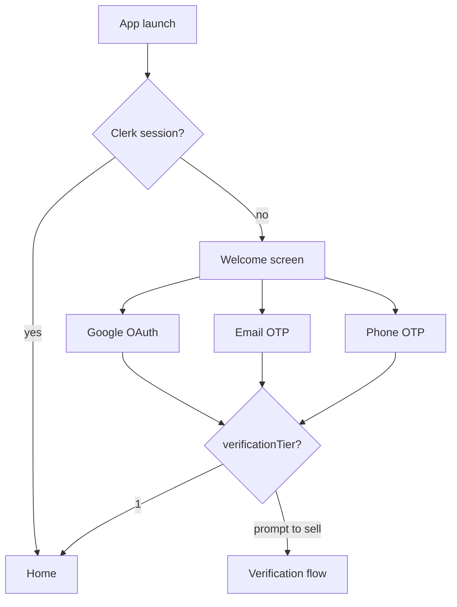
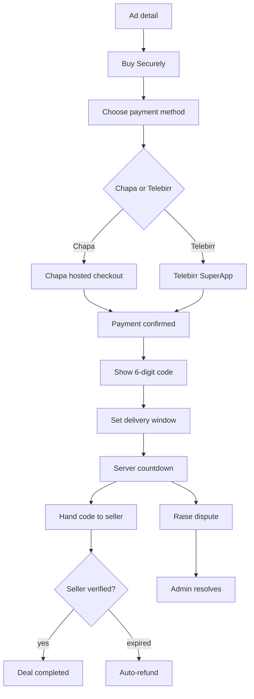
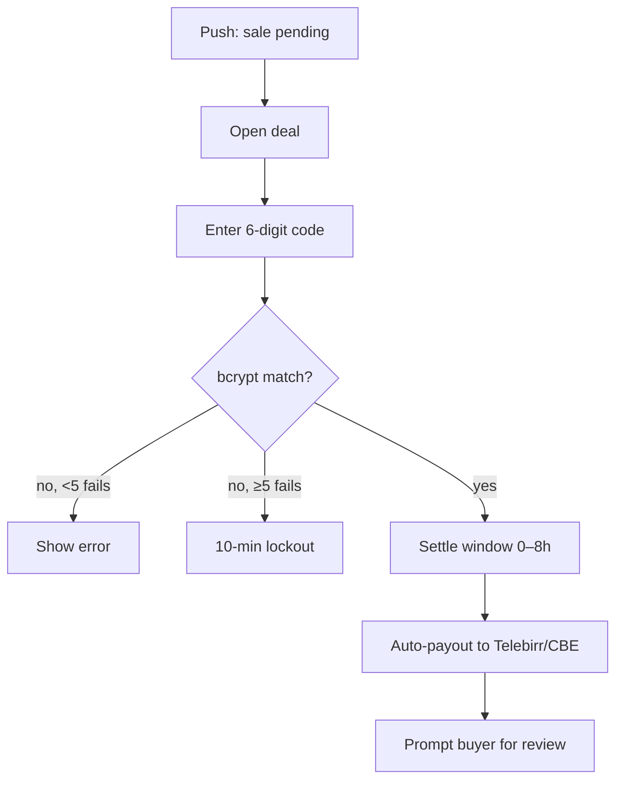
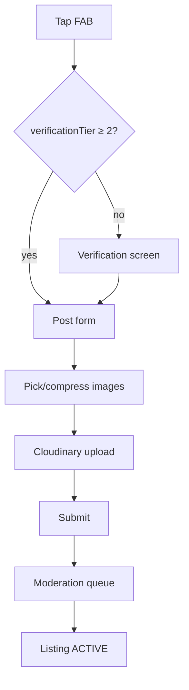
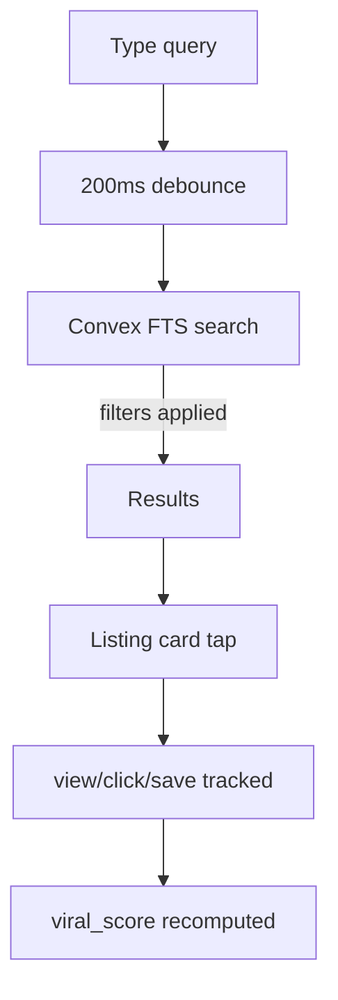
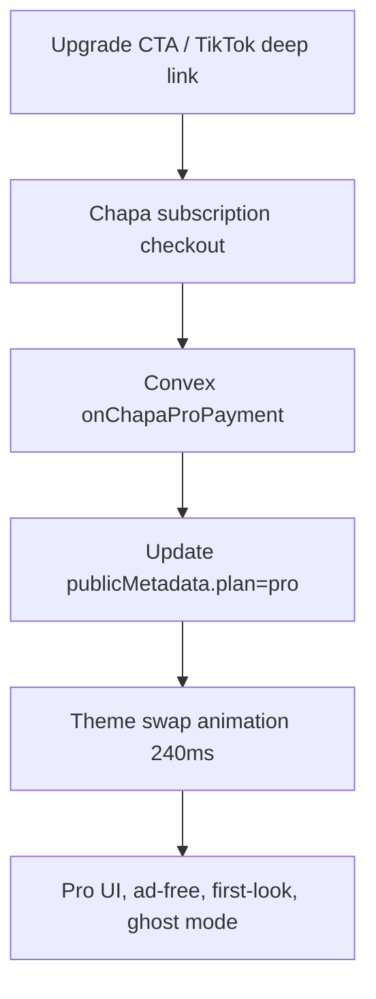
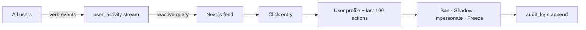

# Bilu Store — Design System (DESIGN.md)

**Companion to**: `docs/PRD.md`, `docs/SYSTEM.md`
**Scope**: Tokens, components, motion, screen flows, admin layout. NativeWind (mobile) + Tailwind (admin web) share a single token source of truth: `src/constants/tokens.ts` (mobile) re-exported from `packages/shared/tokens.ts` (or equivalent path after the pnpm workspace is introduced in Phase 2).

---

## 1. Design Principles

1. **Quiet by default, loud on action.** White surfaces, line-art icons, orange only for the thing the user is about to do.
2. **Weightless motion.** Nothing over 200 ms unless it's a one-shot celebration (success haptic + Lottie).
3. **Accessibility is not a mode.** 4.5:1 contrast minimum, tappable targets ≥ 44×44, every control has a label.
4. **Pro theme earns its gold.** Deep Obsidian + Gold only unlocks on `plan === "pro"`. It should feel like an upgrade, not a skin.

---

## 2. Tokens

### 2.1 Color — Default (Free)

| Token | Hex | Usage |
|---|---|---|
| `brand.primary` | `#FF6B35` | CTAs, active tab, FAB, primary buttons |
| `brand.primaryPressed` | `#E4561E` | pressed state |
| `surface.background` | `#FFFFFF` | screen background |
| `surface.raised` | `#F7F8F9` | cards, sheets, chips |
| `surface.line` | `#E6E8EB` | dividers, 1px borders |
| `text.primary` | `#0F172A` | headings, body |
| `text.secondary` | `#475569` | captions, helper |
| `text.muted` | `#94A3B8` | timestamps, placeholders |
| `semantic.success` | `#12B76A` | verified, completed |
| `semantic.warning` | `#F59E0B` | pending, countdown < 2h |
| `semantic.danger` | `#EF4444` | refund, error, remove |
| `semantic.info` | `#2563EB` | neutral status, links |
| `overlay.scrim` | `rgba(15,23,42,0.56)` | modal backdrops |

### 2.2 Color — Pro

| Token | Hex | Usage |
|---|---|---|
| `pro.background` | `#1A1A2E` | screen background |
| `pro.surface` | `#21213A` | cards |
| `pro.accent` | `#D4AF37` | all CTAs, badges, shimmer |
| `pro.accentSoft` | `#E8C76A` | hover/focus |
| `pro.textPrimary` | `#F5F6FA` |  |
| `pro.textSecondary` | `#A5A9BE` |  |
| `pro.line` | `#2F2F52` |  |

Switch trigger: `useTheme()` reads Clerk `publicMetadata.plan`. No intermediate state — the theme swap animates the top-level `<ThemeProvider>` cross-fade over 240 ms.

### 2.3 Spacing — strict 8-pt grid
`0, 4, 8, 12, 16, 20, 24, 32, 40, 48, 64`. Any other value is a bug.

### 2.4 Radius
| Token | Value | Applies to |
|---|---|---|
| `radius.button` | 8 | buttons |
| `radius.chip` | 10 | chips, filter pills |
| `radius.card` | 12 | listing cards, sheets |
| `radius.sheet` | 16 | bottom sheet top corners |
| `radius.fab` | 9999 | perfect circle FAB |

### 2.5 Typography
Primary family: **Inter** (already in `@expo-google-fonts/inter`). Weights allowed: **400** (body), **600** (semibold headings & buttons). No other weights.

| Token | Size / Line | Use |
|---|---|---|
| `display` | 28 / 34 | hero headings |
| `h1` | 22 / 28 | screen titles |
| `h2` | 18 / 24 | section headings |
| `body` | 15 / 22 | default body |
| `caption` | 13 / 18 | metadata |
| `micro` | 11 / 16 | badges, pills |

### 2.6 Elevation
Three levels only.

| Token | RN style |
|---|---|
| `elev.1` | `shadowOpacity: 0.05, shadowRadius: 4, shadowOffset: {0,2}` |
| `elev.2` | `shadowOpacity: 0.08, shadowRadius: 10, shadowOffset: {0,4}` |
| `elev.proGold` | `shadowColor: #D4AF37, shadowOpacity: 0.35, shadowRadius: 14, shadowOffset: {0,6}` |

### 2.7 Icons
**Phosphor** (already installed). Line-art weight: `regular` by default, `fill` only when a control is active (tab bar). No mixed-family icons in a single view.

### 2.8 Motion
- All transitions 160–200 ms, `ease-out` (`react-native-reanimated`'s `Easing.out(Easing.quad)`).
- Layout animation: `Layout.springify().damping(18)` for list reorders.
- Success celebration: Lottie asset `success_check.json`, 900 ms one-shot, plays once per event.
- Haptics: `Medium` on Pro-only actions, `Light` on every button press.

---

## 3. Core Components

### 3.1 Listing card (feed)
```
┌───────────────────────────────────┐
│                                   │ ← 16:10 image, full-bleed
│          [image]                  │   Cloudinary f_auto, w=800
│                                   │   bottom 40% linear-gradient
│  2,450 ETB · Addis Ababa          │   over the image
└───────────────────────────────────┘
  iPhone 14 Pro · Like New              ← title h2 line, one line ellipsis
  ⭐ 4.8 (32)   Posted 3h ago            ← meta caption
```
- `radius.card`, `elev.1`.
- Pro-seller variant: gold 1px inner border + `elev.proGold`.

### 3.2 Search bar
- 44 h, `surface.raised`, `radius.chip`.
- Leading: `MagnifyingGlass`. Trailing: `SlidersHorizontal` → opens FilterSheet.
- Pro skin: 48 h, `BlurView` tint="dark" intensity=30, 1px gold border.

### 3.3 Buttons
- **Primary**: `brand.primary` bg, white label, `h1` weight. 48 h.
- **Secondary**: bordered, `brand.primary` text, transparent bg.
- **Ghost**: text-only `text.primary`. For "Cancel" slots.
- **Destructive**: `semantic.danger` bg.
- Disabled: 40% opacity, no press ripple.

### 3.4 FAB (Post ad)
- 56 circle, `brand.primary`, `elev.2`. Icon: `Plus` 24. Positioned bottom-right of feed screens (outside tabbar safe area).

### 3.5 Bottom Sheet
- Grab handle 40×4 `surface.line`.
- `radius.sheet` top corners, `elev.2`.
- Dismiss by tap-scrim or down-swipe with velocity > 500.

### 3.6 Empty states
- Lottie animation `empty_cart_particles.json` (to source). 160 px.
- Heading: "We looked everywhere, but couldn't find a match."
- Body (caption): contextual sentence.
- Single primary action: "Reset filters" or "Post the first listing".

---

## 4. Screen Flow Diagrams

### 4.1 Auth


### 4.2 Escrow (buyer perspective)


### 4.3 Escrow (seller perspective)


### 4.4 Post a listing


### 4.5 Search


### 4.6 Pro activation


### 4.7 Admin activity feed


---

## 5. Pro-activation UI upgrade

| Surface | Free | Pro |
|---|---|---|
| Background | `#FFFFFF` | `#1A1A2E` |
| Primary | Orange `#FF6B35` | Gold `#D4AF37` |
| Card | white, `elev.1` | dark surface, gold 1px border, `elev.proGold` |
| Avatar | plain | Lottie shimmer overlay (subtle, 4s loop) |
| Listing hero | 16:10 image | 2:1 full-bleed Cloudinary `w_1600` |
| Search bar | solid | `BlurView` glassmorphism |
| Haptic | light | medium |
| Fonts | Inter 400/600 | same (restraint — do not switch typeface) |

Transition: crossfade root `<ThemeProvider>` + rerender of `<StatusBar>` style. Nav bar retains tab shape; only colors change.

---

## 6. Admin dashboard (Next.js)

Stack: Shadcn/ui + Tremor + Tailwind dark theme.

### 6.1 Layout
```
┌─────────────────────────────────────────────────────────┐
│ Sidebar (240)          │ Topbar (search, actor chip)    │
│ · Pulse                │────────────────────────────────│
│ · Ghost                │                                │
│ · Seller Health        │   Main content                 │
│ · Disputes             │   · activity feed (live)       │
│ · Verification queue   │   · tables w/ Tremor charts    │
│ · Users                │                                │
│ · Audit log            │                                │
│ · Settings             │                                │
└─────────────────────────────────────────────────────────┘
```

### 6.2 Dark theme tokens
Use Tailwind `dark:` variants with: `bg-slate-950`, `text-slate-100`, accent `brand.primary`. Tremor charts: `BarList`, `AreaChart`, `DonutChart` with `colors={["orange", "amber", "emerald", "rose"]}`.

### 6.3 RBAC view deltas

| Capability | Admin | Seller | Buyer |
|---|---|---|---|
| Full audit log | ✅ | own only (last 30d) | own only (last 7d) |
| Freeze deal | ✅ | ❌ | ❌ |
| Ban / shadow / impersonate | ✅ | ❌ | ❌ |
| See real-time activity feed | ✅ (all) | own profile views (Pro) | ❌ |
| Viral score raw value | ✅ | ✅ (own) | ❌ |
| Relist expired listing | ✅ | ✅ | n/a |
| View deal history | ✅ (all) | own deals | own deals |
| See Fayda document URLs | ✅ (until verified; then purged) | ❌ | ❌ |

### 6.4 Admin mobile?
No. Admin is web-only to reduce attack surface. Mobile app enforces this: if `role === "admin"` on sign-in, show a "Admin must use the web dashboard" screen with a logout button.

---

## 7. Motion & Haptic catalog

| Event | Animation | Haptic |
|---|---|---|
| Button press | scale 0.98, 80 ms | light |
| Tab change | 120 ms fade | — |
| Sheet open | slide-up spring | — |
| Favorite toggle | heart bounce 300 ms | light |
| Payment success | Lottie check 900 ms | success (notif) |
| Escrow verified | Lottie gold burst 1.2 s | medium |
| Pro unlocked | theme crossfade 240 ms + gold shimmer | medium |
| Error | screen shake 6 px, 120 ms | error (notif) |

Never exceed 1 celebratory animation per action. Never stack sound effects on haptics.

---

## 8. Accessibility checklist (blocks PR merge if violated)

- [ ] All tappable elements ≥ 44×44 px
- [ ] All images have `accessibilityLabel`
- [ ] Dynamic font scaling capped at 1.3× (no layout explosion)
- [ ] `reduceMotion` → disable non-essential animations (`AccessibilityInfo.isReduceMotionEnabled`)
- [ ] All color pairs meet 4.5:1 contrast (automated check in CI)
- [ ] Form labels present for every input
- [ ] No tap-only state: every gesture has a button alternative

---

## 9. Deliverables checklist

Before Phase 2 code begins:
- [ ] `packages/shared/tokens.ts` exporting all tokens above
- [ ] Figma (or Penpot) board with the 6 flows in §4 as high-fi frames
- [ ] Lottie files: `success_check.json`, `empty_cart_particles.json`, `escrow_gold_burst.json`, `avatar_shimmer.json`
- [ ] Phosphor icon list (name + weight) per screen, pinned to this doc
- [ ] Dark/light mode swap verified on 3 target Android devices (Pixel 6a, Samsung A15, Tecno Camon 20)
