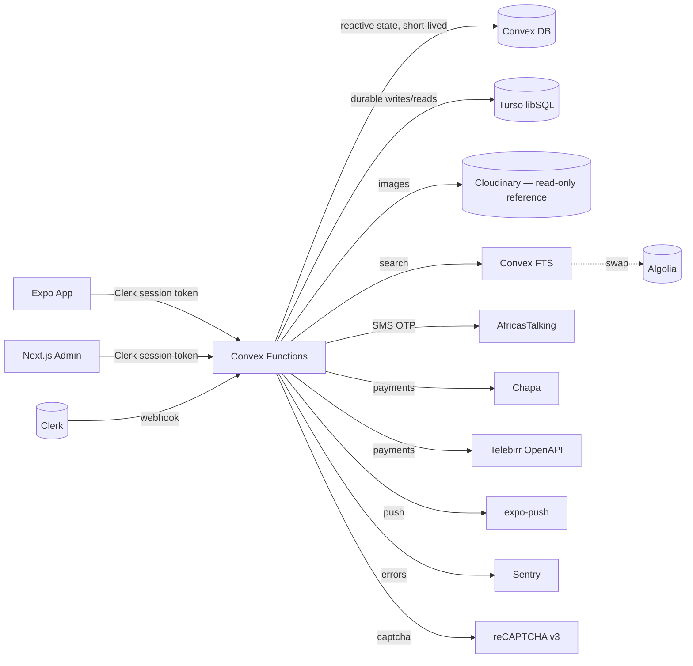

# Bilu Store — System Architecture (SYSTEM.md)

**Companion to**: `docs/PRD.md`
**Scope**: Data schemas (Turso + Convex), indexes, scheduler mechanics, concurrency, security invariants, end-to-end TypeScript type-flow.

---

## 1. Architecture Overview



### Why two databases
| DB | Role | Why |
|---|---|---|
| **Convex** | Reactive, ephemeral, transactional function runtime | Chat, activity feed, 10-min plain OTPs, escrow countdowns (scheduler), live queries |
| **Turso** | Durable, queryable, SQL-first | Listings, users, reviews, audit logs, trust-score aggregates, pro subscriptions — SQL joins + indexes |

Rule of thumb: **writes that must never be lost → Turso. State the UI subscribes to → Convex.** For entities that are both (e.g. listings), Turso is canonical and Convex holds a short-lived reactive mirror kept in sync by Convex mutations.

---

## 2. Turso Schema

### 2.1 Tables

```sql
-- ── USERS ──────────────────────────────────────────────────────────────────
CREATE TABLE users (
  id                    TEXT PRIMARY KEY,              -- Clerk user ID
  email                 TEXT,
  phone                 TEXT,
  name                  TEXT NOT NULL,
  avatar_url            TEXT,
  city                  TEXT,
  lat                   REAL,
  lng                   REAL,
  role                  TEXT NOT NULL DEFAULT 'buyer'  -- buyer | seller | admin
                        CHECK (role IN ('buyer','seller','admin')),
  plan                  TEXT NOT NULL DEFAULT 'free'
                        CHECK (plan IN ('free','pro')),
  plan_expires_at       INTEGER,
  pro_trial_used        INTEGER NOT NULL DEFAULT 0,    -- boolean 0/1
  verification_tier     INTEGER NOT NULL DEFAULT 1
                        CHECK (verification_tier IN (1,2,3)),
  seller_trust_score    REAL NOT NULL DEFAULT 50.0,
  visibility_score      REAL NOT NULL DEFAULT 1.0,     -- 0 = shadow-banned
  banned                INTEGER NOT NULL DEFAULT 0,
  payout_account_json   TEXT,                          -- encrypted PayoutAccount JSON
  created_at            INTEGER NOT NULL,
  last_login_at         INTEGER NOT NULL
);
CREATE INDEX idx_users_role         ON users(role);
CREATE INDEX idx_users_plan         ON users(plan, plan_expires_at);
CREATE INDEX idx_users_trust        ON users(seller_trust_score DESC);
CREATE INDEX idx_users_city         ON users(city);


-- ── LISTINGS ───────────────────────────────────────────────────────────────
CREATE TABLE listings (
  id                INTEGER PRIMARY KEY AUTOINCREMENT,
  seller_id         TEXT NOT NULL REFERENCES users(id),
  title             TEXT NOT NULL,
  description       TEXT NOT NULL,
  category          TEXT NOT NULL,
  subcategory       TEXT,
  price             INTEGER NOT NULL,                   -- cents (ETB × 100)
  currency          TEXT NOT NULL DEFAULT 'ETB',
  condition         TEXT CHECK (condition IN ('NEW','LIKE_NEW','USED_GOOD','USED_FAIR')),
  negotiable        INTEGER NOT NULL DEFAULT 1,
  contact_pref      TEXT NOT NULL DEFAULT 'CHAT_ONLY',
  location_city     TEXT NOT NULL,
  lat               REAL,
  lng               REAL,
  images_json       TEXT NOT NULL,                      -- JSON array of Cloudinary URLs
  thumbnails_json   TEXT NOT NULL,
  status            TEXT NOT NULL DEFAULT 'PENDING_REVIEW'
                    CHECK (status IN ('DRAFT','PENDING_REVIEW','ACTIVE','SOLD','EXPIRED','REJECTED','REMOVED','ARCHIVED')),
  rejection_reason  TEXT,
  is_premium        INTEGER NOT NULL DEFAULT 0,
  premium_tier      TEXT,
  view_count        INTEGER NOT NULL DEFAULT 0,
  click_count       INTEGER NOT NULL DEFAULT 0,
  save_count        INTEGER NOT NULL DEFAULT 0,
  sale_count        INTEGER NOT NULL DEFAULT 0,
  viral_score       REAL NOT NULL DEFAULT 0.0,
  created_at        INTEGER NOT NULL,
  updated_at        INTEGER NOT NULL,
  expires_at        INTEGER NOT NULL
);
CREATE INDEX idx_listings_status_cat       ON listings(status, category);
CREATE INDEX idx_listings_status_price     ON listings(status, price);
CREATE INDEX idx_listings_status_location  ON listings(status, location_city);
CREATE INDEX idx_listings_viral            ON listings(viral_score DESC);
CREATE INDEX idx_listings_created          ON listings(created_at DESC);
CREATE INDEX idx_listings_seller           ON listings(seller_id, status);
CREATE INDEX idx_listings_expiry           ON listings(expires_at) WHERE status = 'ACTIVE';


-- ── ESCROW DEALS ───────────────────────────────────────────────────────────
CREATE TABLE escrow_deals (
  id                      INTEGER PRIMARY KEY AUTOINCREMENT,
  listing_id              INTEGER NOT NULL REFERENCES listings(id),
  buyer_id                TEXT NOT NULL REFERENCES users(id),
  seller_id               TEXT NOT NULL REFERENCES users(id),
  amount                  INTEGER NOT NULL,              -- cents
  commission_amount       INTEGER NOT NULL,              -- cents (computed at init)
  payout_amount           INTEGER NOT NULL,              -- amount - commission
  currency                TEXT NOT NULL DEFAULT 'ETB',
  payment_method          TEXT NOT NULL
                          CHECK (payment_method IN ('CHAPA','TELEBIRR')),
  payment_tx_ref          TEXT NOT NULL UNIQUE,
  token_hash              TEXT,                          -- bcrypt hash of 6-digit code
  status                  TEXT NOT NULL DEFAULT 'pending_payment'
                          CHECK (status IN ('pending_payment','held','verified','completed','refunded','disputed')),
  countdown_expires_at    INTEGER,                       -- epoch ms; null until 'held'
  verified_at             INTEGER,
  payout_release_at       INTEGER,
  completed_at            INTEGER,
  refunded_at             INTEGER,
  disputed_at             INTEGER,
  dispute_reason          TEXT,
  dispute_resolution      TEXT,
  failed_verify_count     INTEGER NOT NULL DEFAULT 0,
  payout_account_snapshot TEXT NOT NULL,                 -- JSON copy at time of initiation
  created_at              INTEGER NOT NULL
);
CREATE INDEX idx_escrow_status_buyer   ON escrow_deals(status, buyer_id);
CREATE INDEX idx_escrow_status_seller  ON escrow_deals(status, seller_id);
CREATE INDEX idx_escrow_countdown      ON escrow_deals(countdown_expires_at)
  WHERE status = 'held';
CREATE INDEX idx_escrow_payout_release ON escrow_deals(payout_release_at)
  WHERE status = 'verified';


-- ── REVIEWS ────────────────────────────────────────────────────────────────
CREATE TABLE reviews (
  id                  INTEGER PRIMARY KEY AUTOINCREMENT,
  deal_id             INTEGER NOT NULL UNIQUE REFERENCES escrow_deals(id),
  reviewer_id         TEXT NOT NULL REFERENCES users(id),
  seller_id           TEXT NOT NULL REFERENCES users(id),
  rating              INTEGER NOT NULL CHECK (rating BETWEEN 1 AND 5),
  comment             TEXT,
  verified_purchase   INTEGER NOT NULL DEFAULT 1,
  created_at          INTEGER NOT NULL
);
CREATE INDEX idx_reviews_seller ON reviews(seller_id, created_at DESC);


-- ── SELLER TRUST (materialized nightly) ───────────────────────────────────
CREATE TABLE seller_trust (
  seller_id         TEXT PRIMARY KEY REFERENCES users(id),
  fulfillment_rate  REAL NOT NULL,
  response_hrs      REAL NOT NULL,
  weighted_rating   REAL NOT NULL,
  trust_score       REAL NOT NULL,
  computed_at       INTEGER NOT NULL
);


-- ── USER ACTIVITY (feed source for admin) ─────────────────────────────────
CREATE TABLE user_activity (
  id            INTEGER PRIMARY KEY AUTOINCREMENT,
  user_id       TEXT NOT NULL REFERENCES users(id),
  verb          TEXT NOT NULL,            -- viewed | clicked | saved | posted | sold | verified
  object_type   TEXT NOT NULL,            -- listing | user | deal
  object_id     TEXT NOT NULL,
  category      TEXT,
  created_at    INTEGER NOT NULL
);
CREATE INDEX idx_activity_created ON user_activity(created_at DESC);
CREATE INDEX idx_activity_user    ON user_activity(user_id, created_at DESC);


-- ── AUDIT LOGS (append-only) ──────────────────────────────────────────────
CREATE TABLE audit_logs (
  id          INTEGER PRIMARY KEY AUTOINCREMENT,
  actor_id    TEXT NOT NULL,                -- user or 'system'
  action      TEXT NOT NULL,                -- e.g. 'escrow.verify', 'admin.ban'
  target_type TEXT,
  target_id   TEXT,
  metadata    TEXT,                         -- JSON
  timestamp   INTEGER NOT NULL
);
CREATE INDEX idx_audit_actor   ON audit_logs(actor_id, timestamp DESC);
CREATE INDEX idx_audit_action  ON audit_logs(action, timestamp DESC);
CREATE INDEX idx_audit_target  ON audit_logs(target_type, target_id, timestamp DESC);
-- Enforced read-only at the app layer: no UPDATE / DELETE statements in code.


-- ── VERIFICATION REQUESTS ─────────────────────────────────────────────────
CREATE TABLE verification_requests (
  id               INTEGER PRIMARY KEY AUTOINCREMENT,
  user_id          TEXT NOT NULL REFERENCES users(id),
  target_tier      INTEGER NOT NULL CHECK (target_tier IN (2,3)),
  fayda_url        TEXT,                    -- tier 2
  selfie_url       TEXT,                    -- tier 2
  trade_license_url TEXT,                   -- tier 3
  tin              TEXT,                    -- tier 3 (stored; not Fayda)
  status           TEXT NOT NULL DEFAULT 'pending'
                   CHECK (status IN ('pending','approved','rejected')),
  admin_id         TEXT,
  admin_note       TEXT,
  submitted_at     INTEGER NOT NULL,
  reviewed_at      INTEGER
);
CREATE INDEX idx_verif_status ON verification_requests(status, submitted_at);


-- ── FAVORITES ─────────────────────────────────────────────────────────────
CREATE TABLE favorites (
  user_id     TEXT NOT NULL REFERENCES users(id),
  listing_id  INTEGER NOT NULL REFERENCES listings(id),
  created_at  INTEGER NOT NULL,
  PRIMARY KEY (user_id, listing_id)
);
CREATE INDEX idx_fav_user ON favorites(user_id, created_at DESC);


-- ── REPORTS ───────────────────────────────────────────────────────────────
CREATE TABLE reports (
  id            INTEGER PRIMARY KEY AUTOINCREMENT,
  reporter_id   TEXT NOT NULL REFERENCES users(id),
  target_type   TEXT NOT NULL CHECK (target_type IN ('listing','user')),
  target_id     TEXT NOT NULL,
  reason        TEXT NOT NULL,
  details       TEXT,
  status        TEXT NOT NULL DEFAULT 'PENDING'
                CHECK (status IN ('PENDING','RESOLVED','DISMISSED')),
  admin_note    TEXT,
  created_at    INTEGER NOT NULL,
  resolved_at   INTEGER
);
CREATE INDEX idx_reports_status ON reports(status, created_at DESC);
```

### 2.2 Required indexes (summary)
`category`, `price`, `location_city`, `viral_score`, `created_at`, `status+category`, `seller_id+status`, `countdown_expires_at (partial)`, `payout_release_at (partial)`, `audit_logs(actor_id, timestamp)`.

---

## 3. Convex Schema (`convex/schema.ts`)

Convex mirrors the subset of Turso tables that benefit from reactive queries. Mirrors are updated inside the same Convex mutation that writes to Turso — keeps `convex/turso.ts` as the only write path.

```ts
import { defineSchema, defineTable } from "convex/server";
import { v } from "convex/values";

export default defineSchema({
  // Reactive mirror — 2 weeks retention, used for feed/search
  listings: defineTable({
    tursoId: v.number(),
    sellerId: v.string(),
    title: v.string(),
    description: v.string(),
    category: v.string(),
    price: v.number(),                // cents
    images: v.array(v.string()),
    locationCity: v.string(),
    status: v.union(
      v.literal("ACTIVE"), v.literal("SOLD"), v.literal("EXPIRED"),
      v.literal("REMOVED"), v.literal("ARCHIVED"), v.literal("PENDING_REVIEW"),
    ),
    viralScore: v.number(),
    isPro: v.boolean(),
    createdAt: v.number(),
    expiresAt: v.number(),
  })
    .index("by_status_category", ["status", "category"])
    .index("by_status_viral", ["status", "viralScore"])
    .index("by_seller", ["sellerId"])
    .searchIndex("search_title", {
      searchField: "title",
      filterFields: ["status", "category", "locationCity"],
    }),

  // Short-lived plain OTP (10 min TTL, buyer-readable only)
  escrowCodes: defineTable({
    dealId: v.number(),               // Turso FK
    buyerId: v.string(),
    code: v.string(),                 // plain 6-digit, UTF-8
    expiresAt: v.number(),
  }).index("by_buyer_deal", ["buyerId", "dealId"]),

  // Chat — lives fully in Convex (no Turso mirror)
  conversations: defineTable({
    listingId: v.number(),
    buyerId: v.string(),
    sellerId: v.string(),
    lastMessage: v.optional(v.string()),
    lastMessageAt: v.number(),
    unreadByBuyer: v.number(),
    unreadBySeller: v.number(),
  }).index("by_buyer", ["buyerId", "lastMessageAt"])
    .index("by_seller", ["sellerId", "lastMessageAt"])
    .index("by_pair_listing", ["listingId", "buyerId", "sellerId"]),

  messages: defineTable({
    conversationId: v.id("conversations"),
    senderId: v.string(),
    text: v.optional(v.string()),
    imageUrl: v.optional(v.string()),
    createdAt: v.number(),
  }).index("by_conversation", ["conversationId", "createdAt"]),

  // Activity feed (live-streamed to admin dashboard)
  userActivity: defineTable({
    userId: v.string(),
    verb: v.string(),
    objectType: v.string(),
    objectId: v.string(),
    category: v.optional(v.string()),
    createdAt: v.number(),
  }).index("by_created", ["createdAt"]),

  // Per-user listing suppression (after 3 partial views)
  listingSuppressions: defineTable({
    userId: v.string(),
    listingId: v.number(),
    until: v.number(),
  }).index("by_user_listing", ["userId", "listingId"])
    .index("by_expiry", ["until"]),

  // Per-user rate limit counters (rolling 1-min bucket)
  rateLimits: defineTable({
    key: v.string(),                  // e.g. "escrow.verify:<userId>"
    windowStart: v.number(),
    count: v.number(),
  }).index("by_key", ["key"]),

  // Partial view counters
  partialViews: defineTable({
    userId: v.string(),
    listingId: v.number(),
    count: v.number(),
    lastAt: v.number(),
  }).index("by_user_listing", ["userId", "listingId"]),
});
```

### 3.1 Typed data-access layer
`convex/turso.ts` exports strongly-typed helpers:

```ts
import { Client } from "@libsql/client/web";
import type { UserRow, ListingRow, EscrowRow /* ... */ } from "./types";

export async function getUser(id: string): Promise<UserRow | null> { /* ... */ }
export async function insertListing(input: InsertListing): Promise<ListingRow> { /* ... */ }
export async function txVerifyEscrow(dealId: number, input: VerifyInput): Promise<EscrowRow> {
  // libSQL transaction — either the whole verification succeeds or nothing changes
}
```

All Turso access goes through this module. **No raw SQL in feature code.**

---

## 4. Scheduler Mechanics (Convex)

### 4.1 Escrow countdown
```ts
// escrow.onPaymentConfirmed
await ctx.db.patch(dealId, { status: "held", countdownExpiresAt, tokenHash });
await ctx.scheduler.runAt(countdownExpiresAt, internal.escrow.onCountdownExpiry, { dealId });
```

### 4.2 `onCountdownExpiry`
```ts
export const onCountdownExpiry = internalAction({
  handler: async (ctx, { dealId }) => {
    const deal = await turso.getEscrow(dealId);
    if (deal.status !== "held") return;            // already verified / disputed
    await turso.txRefund(dealId, { reason: "countdown_expired" });
    await paymentService.refund(deal.payment_method, deal.payment_tx_ref, deal.amount);
    await audit(ctx, "escrow.auto_refund", { dealId });
    await notify(deal.buyer_id, "Refund issued — delivery window expired.");
  },
});
```

### 4.3 Payout release (after verify)
```ts
// inside escrow.verify
await ctx.scheduler.runAt(payoutReleaseAt, internal.escrow.releasePayout, { dealId });
```

### 4.4 Recurring jobs
Registered in `convex/crons.ts`:

| Job | Cadence | Purpose |
|---|---|---|
| `intel.rebuildTrustScores` | daily 03:00 UTC | recompute `seller_trust` + push to Clerk metadata |
| `ads.expireBoosts` | hourly | move expired premium slots out of active |
| `listings.expire` | hourly | `status=ACTIVE` + `expires_at<now` → `EXPIRED` |
| `pro.expirePlans` | daily 00:30 UTC | downgrade expired Pros |
| `activity.prune` | daily 04:00 UTC | delete `user_activity` older than 30 days |
| `escrowCodes.prune` | every 5 min | delete expired plain OTPs from Convex |

---

## 5. Concurrency & Invariants

### 5.1 The "only one code wins" rule
Convex mutations serialize per-document. `escrow.verify(dealId, code)`:
1. Load deal; reject if `status !== "held"` → returns `AlreadyResolved`.
2. Load `token_hash`; `bcrypt.compare(code, hash)` (CPU-bound, keep cost = 10).
3. If mismatch: increment `failed_verify_count`, return error; if ≥ 5 in 10 min → lockout.
4. On match: `UPDATE escrow_deals SET status='verified', verified_at=?, payout_release_at=? WHERE id=? AND status='held'` — guard clause prevents double-verify under any race.
5. Schedule `releasePayout`.

Because Convex mutations run as serializable transactions on the deal document, two concurrent `verify` calls cannot both succeed.

### 5.2 The "no plain code in Turso" rule
- On `escrow.onPaymentConfirmed`: generate `code = crypto.randomInt(100_000, 999_999)`; `tokenHash = bcrypt.hash(code, 10)`.
- Turso stores only `token_hash`.
- Convex `escrowCodes` table holds `{ dealId, buyerId, code, expiresAt: now+10min }`. Indexed by `(buyerId, dealId)`. Query guarded: `if (ctx.auth.userId !== doc.buyerId) throw`.
- `escrowCodes.prune` cron deletes expired rows.

### 5.3 Audit integrity
- `audit_logs` has no `UPDATE` or `DELETE` path in code. ESLint rule forbids the strings `UPDATE audit_logs` / `DELETE FROM audit_logs`.
- Actor = `ctx.auth.userId ?? "system"`.

### 5.4 Clerk ↔ Turso sync
- Source of truth: **Turso `users`** for role/plan internal use; **Clerk `publicMetadata`** is a read-optimized cache for the client.
- Every mutation that changes role/plan/tier writes Turso → then calls `clerk.users.updateUserMetadata()`.
- Hourly `reconcile.clerkMetadata` cron detects drift (should never happen; logs + pages if it does).

---

## 6. End-to-end TypeScript safety

```
convex/schema.ts                → generates convex/_generated/api.d.ts
convex/turso_types.ts           → hand-written (kept in sync with SQL migrations)
packages/shared/types.ts        → re-exports that both the mobile app and admin web import

 shared                          mobile + web              convex
 ┌──────────┐   import types    ┌───────────┐  useMutation ┌───────────┐
 │  User    │─────────────────▶│  Screen   │─────────────▶│ mutation  │
 │  Listing │                   │ Component │              │           │
 │  Deal    │                   └───────────┘              └───────────┘
 └──────────┘
```

**Rule**: no type duplication. If the UI needs a shape, import from `packages/shared/types`. Convex mutations validate input with `v` validators — which also produce the TS type.

---

## 7. Security invariants (must hold at all times)

| # | Invariant | Enforced by |
|---|---|---|
| 1 | Every Convex function checks `ctx.auth` before returning data | lint rule + code review |
| 2 | Admin mutations call `assertAdmin(ctx)` | helper function used by 100% of admin mutations |
| 3 | Escrow verify is rate-limited per (user, dealId) | `withRateLimit(3/min)` wrapper + 5-fail lockout |
| 4 | Plain OTP never persisted in Turso | OTP generation is only in `escrow.onPaymentConfirmed`; Turso write omits it |
| 5 | Fayda documents auto-deleted after verification decision | Convex Action `verification.finalize` deletes Cloudinary assets |
| 6 | Payout account write requires step-up auth | `requireReauth(5)` before `payout.update` mutation |
| 7 | `audit_logs` is append-only | ESLint forbid-update-delete + DB role permissions |
| 8 | No `UPDATE listings SET seller_id=...` path exists | seller cannot be reassigned — listing is immutable on that axis |

---

## 8. Migration from Firebase — data mapping

| Firestore collection | Turso table | Notes |
|---|---|---|
| `users` | `users` | `role` normalized (`USER` → `buyer`); `banned` copied |
| `ads` | `listings` | images JSON; price × 100 → int; status enum widened |
| `reviews` | `reviews` | require `deal_id` backfill — discard reviews without deals (policy decision in IMPLEMENTATION_PLAN §P4) |
| `favorites` | `favorites` | PK = (user_id, listing_id) |
| `reports` | `reports` | 1:1 |
| `premium_ads` | merged into `listings.is_premium`+`premium_tier` and a separate `premium_history` (omitted in v2 MVP unless needed for analytics) |
| `escrow_transactions` | `escrow_deals` | rename; commission recomputed under new rate table; **OTP hash is NOT migrated — old escrows cannot be verified post-cutover; admin finalizes manually** |
| `escrow_otps` | Convex `escrowCodes` | one-time migration, then discarded |
| `payment_sessions` | folded into `escrow_deals.payment_tx_ref` |
| Chat `conversations` / `messages` | Convex `conversations` / `messages` | no Turso copy |

Migration runner lives in `scripts/migrate/` and is single-use — run once, verified via record-count checks, then deleted from the repo.
